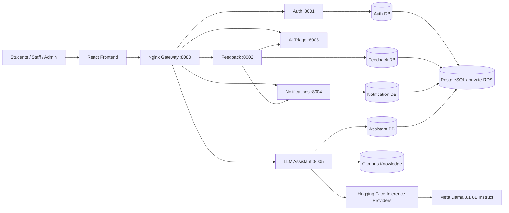

# CampusPulse AI

**AI-Powered Campus Feedback, Issue Management and Hosted Llama Assistance Platform**

CampusPulse AI is a cloud-native SWE7303 DevOps project designed as a coherent multi-service engineering system rather than a tutorial scaffold. It combines role-based campus feedback management, reproducible lightweight ML triage, a hosted Llama conversational assistant through Hugging Face Inference Providers, PostgreSQL persistence, automated testing, containerisation, CI/CD, security gates, observability and AWS blue-green deployment configuration.

The assessed design targets the technical requirements in the SWE7303 brief: Git/Jenkins/Docker, multiple microservices, AWS CodeCommit/CodeBuild/Elastic Beanstalk, automated testing, minimal-downtime deployment, monitoring/logging, rollback and maintainable documentation. See `docs/HD_RUBRIC_TRACEABILITY.md` for the evidence map. A source repository cannot guarantee a grade; the final mark also depends on real deployment evidence, the written report, academic sources and genuine personal reflection.

## System capabilities

### Application
- STUDENT / STAFF / ADMIN accounts with JWT authentication and server-side RBAC.
- Feedback CRUD, comments, assignment and validated lifecycle: `SUBMITTED → ASSIGNED → IN_PROGRESS → RESOLVED → CLOSED`, with controlled reopen paths.
- Audit records for security/workflow decisions.
- In-app notifications and unread state.
- Database-derived analytics and Recharts dashboards.
- Accessible responsive React/Vite/TypeScript interface.

### Hosted Llama AI triage
- `meta-llama/Llama-3.1-8B-Instruct` through Hugging Face Inference Providers for category, sentiment and priority;
- no local AI model weights or ML runtime dependencies;
- schema-validated outputs, model-reported confidence signals and `needs_review`;
- deterministic safety layer for fire/gas/electrical/weapon/violence/structural dangers;
- human category/priority override with reason and decision-source traceability.

### Hosted Hugging Face Llama assistant
- independent `assistant-service` microservice;
- default model `meta-llama/Llama-3.1-8B-Instruct`;
- Hugging Face Inference Providers with `provider=auto`;
- no PyTorch/Transformers/model weights in the application image;
- dependency-free TF-IDF/cosine RAG-style grounding over a version-controlled CampusPulse knowledge base;
- persistent per-user chat sessions and source cards;
- prompt-injection protection and immediate-hazard guardrails before generation;
- bounded HTTP timeout/retry policy and graceful 503 behaviour when the provider is unavailable;
- token supplied only through `.env`, Jenkins secret injection, or AWS Secrets Manager;
- no tool capability to mutate issues/users, preserving human operational control.

**Cost note:** Hugging Face Inference Providers has a limited monthly free credit allocation for Free accounts; it is not unlimited free inference. Provider/model availability and pricing can change, so verify the official Hugging Face pricing page before demonstration/deployment.

## Architecture



See `docs/ARCHITECTURE.md` and reproducible Mermaid sources under `docs/diagrams/`.

## Repository map

```text
CAMPUSPULSE-AI/
├── frontend/                       React/Vite/TypeScript UI
├── gateway/                        Nginx API gateway
├── services/
│   ├── auth-service/               identity, roles, user audit
│   ├── feedback-service/           CRUD/workflow/comments/analytics/overrides
│   ├── ai-service/                 hosted Llama triage + deterministic safety layer
│   ├── notification-service/       persistent notifications
│   └── assistant-service/          hosted Llama API + retrieval + guardrails + chat DB
├── tests/                           integration and smoke tests
├── devops/jenkins/                 Jenkins local guidance
├── devops/monitoring/              Prometheus/Grafana provisioning
├── infrastructure/terraform/       AWS IaC
├── infrastructure/aws/             ECR/Beanstalk/CodeBuild scripts and templates
├── scripts/                         Windows + Bash workflows
├── docs/                            architecture/API/security/models/evidence/mapping
├── buildspec.yml                    AWS CodeBuild verification
├── Jenkinsfile                      primary CI/CD pipeline
├── docker-compose.yml               full local stack
└── docker-compose.observability.yml optional monitoring
```

## Local quick start — Windows PowerShell

Prerequisites: Docker Desktop/Compose, Git, Internet access for hosted inference, and a Hugging Face user token with Inference Providers permission and access to the selected Meta Llama model.

```powershell
Copy-Item .env.example .env
.\scripts\set-hf-token.ps1
.\scripts\dev-up.ps1
```

Open `http://localhost:8080`.

The assistant image contains no LLM weights. Runtime chat calls are sent to Hugging Face Inference Providers using `HF_TOKEN`; the token remains server-side and is never sent to the browser.

Stop:
```powershell
.\scripts\dev-down.ps1
```

## Local quick start — Bash

```bash
cp .env.example .env
./scripts/set-hf-token.sh
./scripts/dev-up.sh
```

## Local demo accounts

| Role | Email | Password |
|---|---|---|
| Student | `student@campuspulse.dev` | `Student123!` |
| Staff | `staff@campuspulse.dev` | `Staff123!` |
| Admin | `admin@campuspulse.dev` | `Admin123!` |

**Development demonstration only — never use these credentials in production.** Production Terraform sets `SEED_DEMO=false` and uses Secrets Manager values.

## Key demonstrations

1. Submit `Exposed electrical wiring outside science laboratory` with exposed wires near students. The safety layer must produce `CRITICAL / SAFETY_RULE` and human review.
2. Submit ordinary Library Wi-Fi instability. It must not trigger the critical safety rule.
3. Staff assigns/updates an issue and overrides an AI output with a reason; admin sees audit/analytics.
4. Ask the Assistant how to report Wi-Fi. The UI shows a generated grounded answer and retrieved sources.
5. Ask the assistant to reveal its system prompt/JWT secret. It refuses before model generation.
6. Ask about an active fire/gas leak/exposed wires. Deterministic human-safety guidance takes priority over generation.

## Tests and evaluations

```bash
./scripts/test-all.sh
python tests/integration/run_local_flow.py
make assistant-evaluate
```

See `docs/TEST_REPORT.md` for the current executed test count. Unit/integration tests use a deterministic assistant backend or a mocked Hugging Face client so CI does not spend external inference credit. A separate hosted-Llama smoke test is provided for real token/model/provider verification.

AI triage control evaluation:
```bash
cd services/ai-service
PYTHONPATH=. python evaluation/evaluate.py
```

LLM retrieval/guardrail evaluation:
```bash
cd services/assistant-service
PYTHONPATH=. python evaluation/evaluate.py
```

## Docker and observability

```bash
docker compose config
docker compose up --build -d
python scripts/wait_for_stack.py --url http://localhost:8080 --timeout 360
python tests/smoke/smoke.py
```

Optional Prometheus/Grafana:
```bash
docker compose -f docker-compose.yml -f docker-compose.observability.yml up -d prometheus grafana
```

Prometheus scrapes all backend services. The dashboard includes request/error/latency, triage inference, assistant generation latency/volume and guardrail activity.

## Jenkins CI/CD

The root Jenkinsfile is the primary release pipeline:

`checkout → environment validation → install CI dependencies → lint → backend tests → AI/LLM evaluation → frontend tests/build → integration → Bandit/pip-audit/npm audit → Docker build → Trivy → Compose smoke → immutable tag → ECR → optional CodeBuild → inactive Beanstalk → readiness/smoke → approval → CNAME swap → production smoke → archive`.

A reversible failure demonstration proves a failed test prevents cloud promotion. See `docs/DEMO_SCRIPT.md` and `devops/jenkins/README.md`.

## AWS DevOps architecture

Terraform provisions/configures:
- VPC across two AZs, public ALB/application subnets and private RDS subnets;
- separate ALB and application security groups; application port is not directly open to the Internet;
- seven immutable/scan-on-push ECR repositories;
- private encrypted RDS PostgreSQL;
- Secrets Manager values for JWT/internal token/database URLs;
- IAM instance/service/build roles;
- S3 Elastic Beanstalk deployment artefacts;
- BLUE and GREEN load-balanced Elastic Beanstalk environments;
- enhanced health and CloudWatch log streaming;
- CloudWatch/SNS baseline alarms;
- optional CodeCommit mirror and CodeBuild independent CI verification.

AWS deployment uses a one-shot database bootstrap to create four logical databases on RDS before each data-owning service runs Alembic migrations. Secrets are supplied to Elastic Beanstalk as runtime environment secrets rather than rendered into the source bundle.

See `docs/AWS_DEPLOYMENT_CHECKLIST.md` before deploying.

## Blue-green and rollback

Jenkins deploys the candidate SHA to the inactive Elastic Beanstalk environment. Traffic is unchanged until health/readiness and functional smoke pass. Promotion uses an explicit CNAME swap. The previously healthy environment remains available for rapid reversal with `scripts/aws-rollback.sh` or `.ps1`. A local rollback simulation demonstrates the gating logic without claiming a cloud event occurred.

## Security

The implementation includes bcrypt, JWT expiry/RBAC, inactive-user checks, Pydantic validation, SQLAlchemy parameterisation, environment/Secrets Manager configuration, service-to-service credentials, private RDS, structured non-secret logging, audit trails, ECR immutability/scanning, Bandit/pip-audit/npm audit/Trivy CI gates and LLM-specific input/grounding controls. See `docs/SECURITY.md` for limitations and required production hardening.

## Release packaging

```bash
./scripts/package-release.sh
```

The package excludes `.env`, Hugging Face tokens, cloud credentials, private keys, local DBs, Git metadata, virtual environments, `node_modules`, caches and Terraform state. No LLM weights are downloaded or packaged.

## Documentation index

- `docs/HD_RUBRIC_TRACEABILITY.md` — direct SWE7303/rubric engineering evidence map.
- `docs/ARCHITECTURE.md` — application, AI, LLM, data, CI/CD and deployment architecture/trade-offs.
- `docs/LLM_ASSISTANT.md` / `docs/LLM_MODEL_CARD.md` / `docs/LLM_EVALUATION.md` — hosted Hugging Face Llama subsystem.
- `docs/AI_MODEL_CARD.md` / `docs/AI_EVALUATION.md` — triage ML governance/evaluation.
- `docs/API.md` / `docs/DATABASE.md` — contracts and persistence.
- `docs/DEVOPS_PIPELINE.md` / `docs/DEPLOYMENT.md` / `docs/AWS_DEPLOYMENT_CHECKLIST.md` — CI/CD and cloud procedure.
- `docs/SECURITY.md` / `docs/MONITORING.md` / `docs/ROLLBACK.md` — operational controls.
- `docs/TEST_REPORT.md` — executed validation only.
- `docs/DEMO_SCRIPT.md` / `docs/EVIDENCE_CHECKLIST.md` — practical assessment evidence.
- `docs/GANTT_PLAN.md` / `docs/GROUP_PROPOSAL_FRAMEWORK.md` — planning artefacts.
- `docs/PERSONAL_REFLECTION_FRAMEWORK.md` — genuine reflection evidence framework, not fabricated prose.
- `docs/RESEARCH_SOURCE_PLAN.md` — HE7 academic-source plan.

## Important limitations

This is a master's-level demonstration system, not an institutional production certification. Synthetic triage data cannot establish population validity; deterministic safety/prompt-injection rules can miss paraphrases; hosted Llama can hallucinate or misunderstand; the service depends on Internet/provider availability and limited external inference credits; a single RDS instance is a demonstration cost trade-off; and production use needs real load testing, TLS/WAF/SSO, privacy retention, backup-restore tests and broader LLM red-team evaluation.
