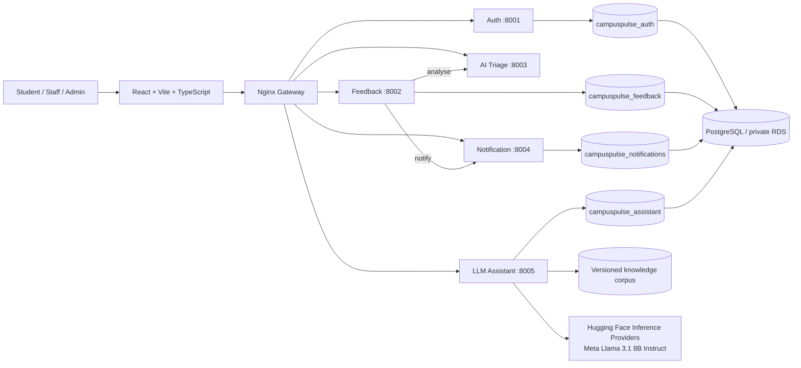
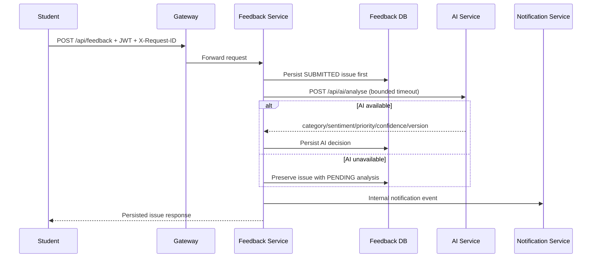
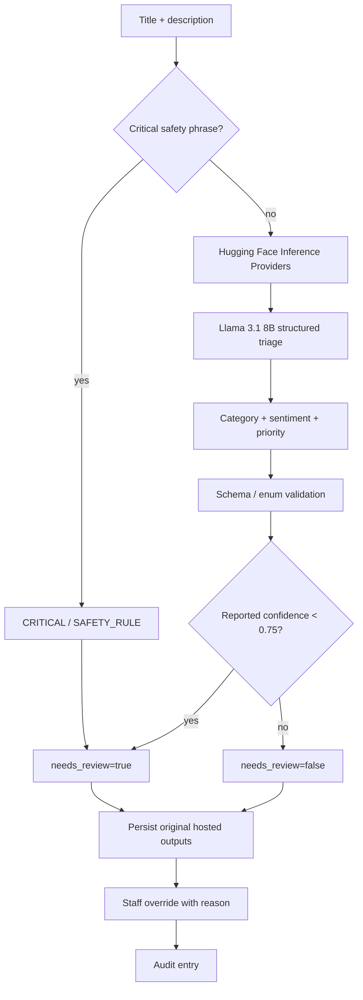
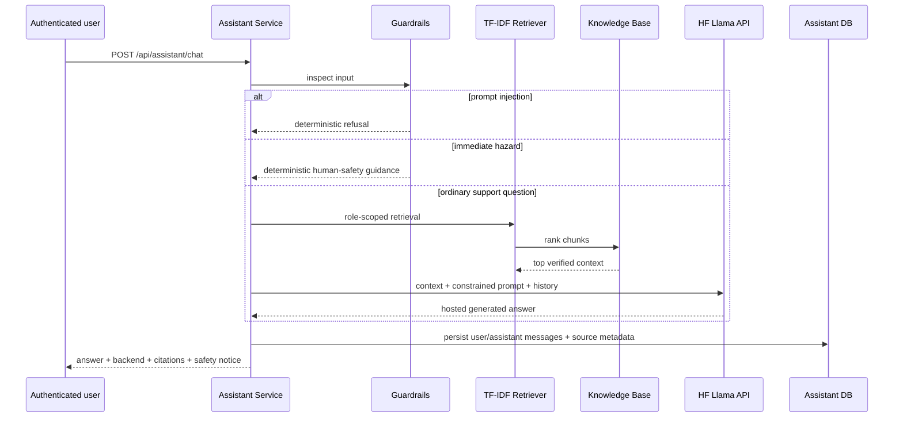
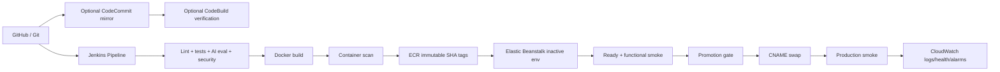

# CampusPulse AI Architecture

## Overall cloud-native application

The gateway is the default ingress. Application services are independently containerised and own their schemas/data. The triage and conversational assistant are intentionally different microservices even though both use hosted Llama: triage has strict schema validation and safety-rule semantics, while free-form assistance has retrieval grounding and conversational guardrails. This preserves independent scaling, failure isolation and testability.

## Feedback submission sequence

The reliability invariant is **persist first, enrich second**. AI failure must not destroy a student submission.

## AI triage decision

## LLM assistant sequence

## Data architecture
One PostgreSQL server may host four logical databases for the demonstration. This preserves service ownership while avoiding four RDS instances. There are no cross-service database foreign keys. A deployment bootstrap command creates logical databases before data-owning containers execute Alembic migrations.

## CI/CD and AWS deployment

Jenkins is the primary release orchestrator because the brief explicitly requires it and its stages are easy to demonstrate. CodeCommit/CodeBuild are provided as an AWS-native mirror/independent verification path so the project demonstrates the named AWS services without replacing the Jenkins learning outcome.

## Blue-green availability model
Version B is deployed to the inactive environment while Version A continues serving production. Traffic switches only after candidate health/smoke verification and a controlled promotion gate. The previous environment is retained long enough for fast CNAME reversal. This uses more temporary capacity than rolling deployment but makes rollback state explicit and demonstrable.

## Observability
All FastAPI services expose liveness/readiness and Prometheus metrics. Structured logs carry `request_id`, service, path, status and latency while excluding passwords/JWT/secrets. Local Prometheus/Grafana gives application-level telemetry; Elastic Beanstalk log streaming and CloudWatch alarms provide the AWS operational path.

## Deliberate trade-offs
- **Elastic Beanstalk vs ECS/EKS:** Beanstalk satisfies the assessed AWS deployment requirement with lower orchestration overhead; ECS/EKS would provide more control but add scope and operational surface.
- **One RDS instance vs database per service:** logical databases retain ownership at lower demonstration cost; stronger isolation/independent scaling may justify separate data platforms in production.
- **Synchronous HTTP vs broker:** HTTP keeps flows inspectable; a broker would improve event decoupling/delivery semantics at higher complexity.
- **Hosted Llama 3.1 8B vs local LLM:** hosted inference avoids shipping multi-GB weights and GPU/CPU runtime dependencies in CampusPulse images, but introduces provider quota, network latency and third-party availability dependencies.
- **TF-IDF RAG vs vector database:** version-controlled TF-IDF retrieval is reproducible and sufficient for a small knowledge corpus; semantic vector search becomes stronger as corpus size/linguistic variability grows.
- **Hugging Face hosted API vs self-hosting:** hosted inference sharply reduces image size and Beanstalk memory pressure; self-hosting provides greater runtime independence/data control but would require model lifecycle, accelerators or substantially larger CPU/RAM capacity.
