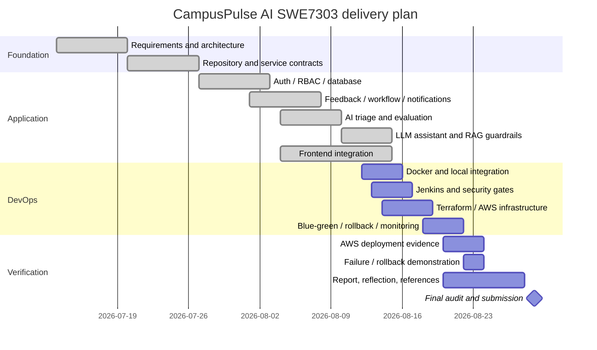

# Implementation Gantt Plan

Dates are a project planning baseline. The group should update actual progress/evidence rather than presenting the diagram as historical fact where work was completed at different times.
