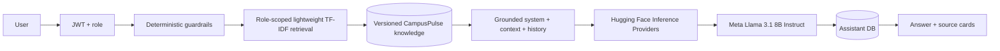

# CampusPulse Hosted Llama Assistant

## Purpose
CampusPulse Assistant is a separate FastAPI microservice for conversational support. It explains CampusPulse workflows, helps users structure issue descriptions, and answers campus-process questions using retrieved project knowledge. It does **not** mutate issues, users, roles, priorities, or workflow state.

## Hosted model
Default model: `meta-llama/Llama-3.1-8B-Instruct`.

Runtime provider: Hugging Face Inference Providers, configured with `ASSISTANT_PROVIDER=auto`. The service uses `huggingface_hub.InferenceClient`; no Llama weights, PyTorch, Transformers runtime, GPU driver, or model cache is required in the CampusPulse container.

Official references to verify before deployment:
- https://huggingface.co/docs/inference-providers/index
- https://huggingface.co/docs/inference-providers/en/tasks/chat-completion
- https://huggingface.co/meta-llama/Llama-3.1-8B-Instruct
- https://huggingface.co/docs/hub/security-tokens

Hugging Face Free accounts receive limited monthly Inference Providers credits. This must be treated as a demonstration allowance, **not unlimited free production inference**. Quotas, providers and prices can change.

## Access prerequisite
The Meta Llama repository is gated. The Hugging Face account used for deployment must accept the applicable Meta Llama terms and the token must have Inference Providers permission. A valid token alone does not guarantee model/provider availability or remaining credit.

## RAG flow


The retriever is implemented in dependency-free Python. It computes TF-IDF weights and cosine similarity over the small curated knowledge corpus. This preserves transparent source grounding without shipping NumPy/SciPy/scikit-learn into the assistant image.

## Security and privacy controls
`HF_TOKEN` is server-side only. It is read from `.env` for local development, can be injected by a Jenkins secret credential, and is stored in AWS Secrets Manager for Elastic Beanstalk. It must never be placed in React/Vite variables, source control, screenshots, logs, prompts, Docker build arguments, Terraform tfvars committed to Git, or release ZIPs.

`services/assistant-service/app/llm.py` never adds the token to prompt content. Release scanning includes a Hugging Face token pattern to prevent accidental packaging.

## Reliability
Hosted generation uses a finite timeout and bounded retries for provider throttling/transient 5xx responses. There are no unbounded retries. When `ASSISTANT_REQUIRE_LLM=true`, provider failure returns a controlled HTTP 503 rather than fabricating an LLM response. CI can set `ASSISTANT_BACKEND=template` and `ASSISTANT_REQUIRE_LLM=false` to test the application path without consuming third-party inference credits.

Deterministic guardrails still run before any external call. Immediate-hazard and prompt-injection cases can therefore produce a safe deterministic response without spending inference credit.

## Configuration
- `HF_TOKEN`
- `ASSISTANT_MODEL_ID=meta-llama/Llama-3.1-8B-Instruct`
- `ASSISTANT_PROVIDER=auto`
- `ASSISTANT_BACKEND=huggingface`
- `ASSISTANT_REQUIRE_LLM=true`
- `ASSISTANT_API_TIMEOUT_SECONDS=45`
- `ASSISTANT_MAX_RETRIES=2`
- `ASSISTANT_MAX_NEW_TOKENS=220`
- `ASSISTANT_TEMPERATURE=0.2`
- `ASSISTANT_TOP_P=0.9`

## Local token setup
PowerShell:
```powershell
Copy-Item .env.example .env
.\scripts\set-hf-token.ps1
```

Bash:
```bash
cp .env.example .env
./scripts/set-hf-token.sh
```

The helper prompts without placing the token directly in terminal history, then writes it only to the ignored local `.env` file.

## Hosted API smoke test
After configuring `HF_TOKEN`:
```bash
PYTHONPATH=services/assistant-service python tests/smoke/hf_llama_smoke.py
```
This makes a real inference call and consumes a small amount of available provider credit. It is intentionally separate from normal unit tests.

## Responsible-AI boundary
The chatbot is advisory. Campus safety, status changes, assignments, AI priority overrides, account administration, and other consequential actions remain deterministic authenticated application operations requiring human authority. Source retrieval and safety rules reduce risk but do not guarantee factuality or safety.
